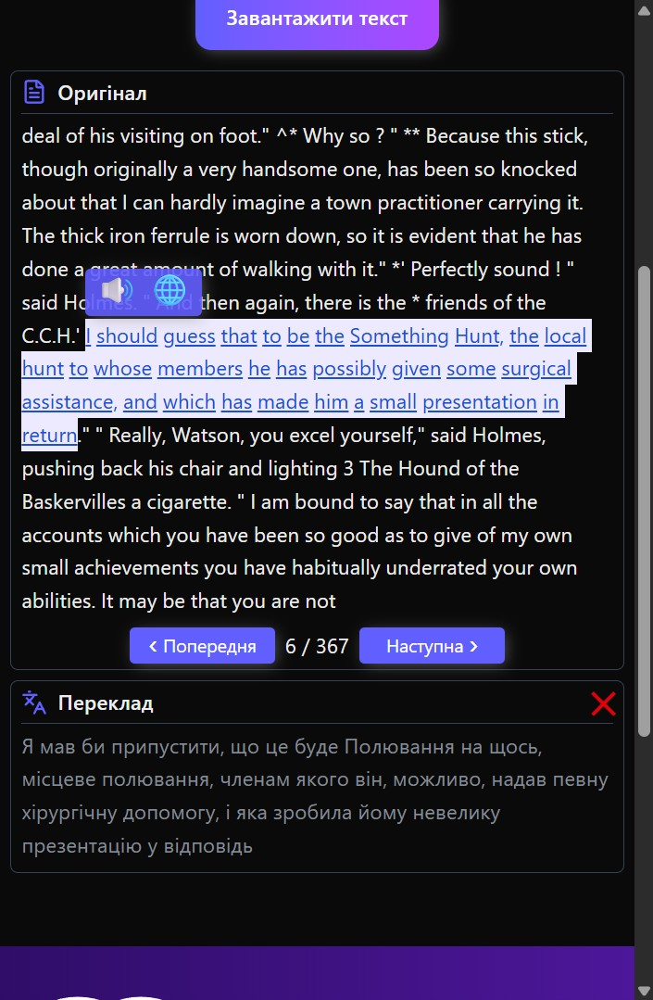

**Speak Text** is a web application for interactive text translation and speech.  
It allows you to upload text files, translate them into any language, highlight words or sentences for pronunciation or translation, and switch between light/dark themes and interface languages.

---

## 🚀 Live Site
Try the web application here:  
👉 [**speak-text-alpha.vercel.app**](https://speak-text-alpha.vercel.app/)

---

## 🛠 Features
- 🔹 **Theme Switching** – light and dark mode.  
- 🔹 **Interface Language Switching** – the text will be automatically translated to the chosen interface language.  
- 🔹 **File Upload** – supports `.txt`, `.docx`, and PDF files.  
- 🔹 **Interactive Word Translation & Speech** – click on a word to hear its correct pronunciation **and** see its translation.  
- 🔹 **Sentence Translation or Speech** – highlight a sentence and choose whether to play speech or translate it.  

---

## 📦 Technologies Used
- **Next.js 16** – React framework.  
- **React 19** – component-based approach.  
- **Redux Toolkit & React-Redux** – state management.  
- **TailwindCSS 4** – styling and responsive design.  
- **i18next & react-i18next** – multilingual support.  
- **react-pdf & mammoth** – working with PDF and Word files.  
- **franc & translate** – language detection and translation.  
- **winston & winston-daily-rotate-file** – logging.  
- **lucide-react** – icons.  

---

### Screenshots
  

      
      
  

